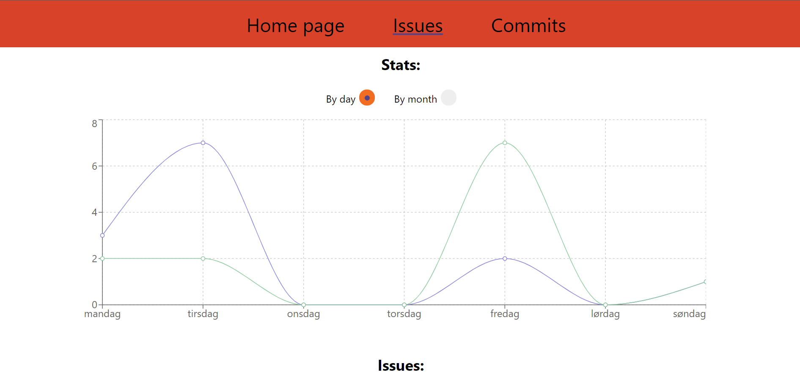
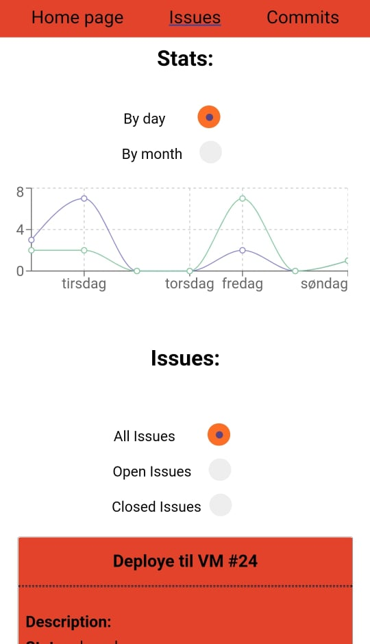
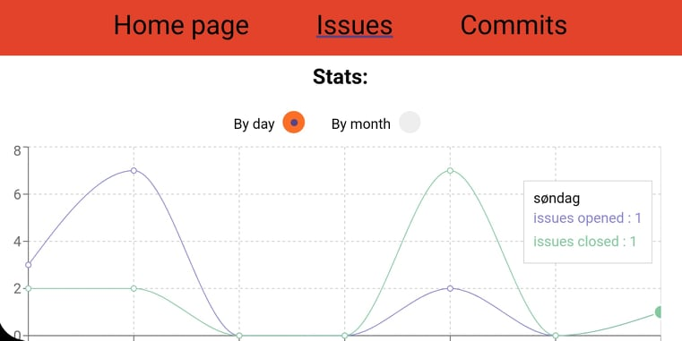

# Documentation

## Hvilken data har vi hentet fra gitlab?

Gruppa bestemte seg for å fokusere på å hente ut data rundt commits og issues. Vi designet nettsiden med en hjemmeside med prosjektnavnet og bilde til gitlab repoet, og så kan man navigere seg fram til andre sider fra navigasjonsmenyen. Navigasjonsmenyen ligger på toppen og man kan velge å vise hjemmesiden, issues eller commits.

På siden med issues kan man se en graffremstilling av antall issues som ble åpnet og antall issues som ble lukket. Brukeren av nettsiden kan selv velge om de ønsker å se graffremvisning fra den siste uken eller de siste 7 månedene. Under finner man en liste med alle issues fra repoet, og litt enkel informasjon om dem. Det innebærer navn, nummer, beskrivelse, labels, og når de ble åpnet og eventuelt lukket. Denne listen med issues kan filtreres av brukeren til å vise alle issues, alle åpne issues, og alle lukkede issues. 

På siden med commits kan man se en lignende type graffremstilling som på siden med issues, bare at her ser man commits lagt til i main-branchen de siste 7 dagene eller månedene. Under finner man en liste med commits, der man kan via en dropdown meny velge hvilke commits man vil se, ut fra hvilken branch de hører til. Velger man en branch i menyen vil alle commitsene som ligger i den branchen bli representert med commit-melding, id, hvem som har committet, og når den ble committet. 

Disse valgene har vi tatt basert på hva gruppa ønsket å jobbe med, og hvordan data allerede er representert på gitlab.

## Hvordan har vi hentet ut fra/brukt context apiet?
Context APIet brukes blandt annet i hierarkiet av issuekomponenter. Komponenten IssueContextProvider oppretter først en kontekst. Deretter henter IssueComponent ut en liste med alle issues og bruker deretter denne konteksten og "provider" den videre til alle barna sine som igjen kan "consume" disse verdiene. Fordelen med å gjøre det på denne måten er at vi reduserer antall API-kall betraktelig. I stedet for at hver enkelt komponent skal hente den samme informasjonen med hvert sitt API- kall holder det med 1 kall hvor IssueComponent henter ut all den nødvendige informasjonen for deretter å sende denne videre i form av kontekst.

## Hvordan har vi brukt...

### Storage

I prosjektet har vi brukt både sessionstorage og localstorage. Sessionstorage er brukt for å lagre hvilken radiobutton som er valgt under commit-siden. Loalstorage er brukt for å lagre hvilken radiobutton som er klikket på under issue-siden. 

Disse valgene er tatt hovedsakelig basert på at gruppa skal lære seg å bruke teknologiene. Selv om det kunne være mer hensiktsmessig å være konsekvent når man bruker de forskjellige lagringsmulighetene på like funksjoner, så var disse nå brukt i en læringssituasjon.
 

### brukt komponenter og props

Gruppa har laget nye komponenter der vi har hentet data fra apiet og framstilt det med HTML teknologi fra typescript-filer. Komponentene henter props fra en annen typescript-fil, og bruker disse til å fylle inn data. s

### effects og state?

State er brukt på data som er hentet ut fra gitlab gjennom apiet og tilegnet variabler som endrer seg. Da settes staten via brukerinteraksjoner som gjør at framstillingen av data skal endre seg. Effects har gruppa brukt når state skal initialiseres i dette prosjektet. 

## Hvordan har vi testet?

I dette prosjektet har vi brukt testrammeverket Jest som fungerer på blant annet TypeScript og React, som vi har brukt. På alle komponentene har vi snapshottest, og det hjelper oss å sørge for at brukergrensesnittet ikke endrer seg uforutsigbart. Snapshottestene fungerer på den måten at den renderer et komponent, generer en serialisererbar verdi og sammenlikner denne med en snapshotfil ved siden av testen. Dersom snapshotene ikke er like vil testen feile. 

Underveis i implementasjon av komponentene og sidene brukte vi nettleseren til å teste. Med nettleseren testet vi både funksjonalitet og design. Dette gjorde vi ved å teste med ulike skjermstørrelser og sjekket om funksjonaliteten stemte og var like for alle. For å gjøre dette endret vi størrelsen på hele vinduet og brukte den innebygde funksjonen "toggle device toolbar" inne i "inspiser". Med "toggle device toolbar" kunne vi velge egendefinerte skjermstørrelser og/eller spesifikke enheter. Disse metodene hjalp oss å følge med på om designet var responsiv. 

Selv om vi testet ulike skjermstørrelser i nettleseren, åpnet vi også nettsiden på andre enheter for å være på den sikre siden. Både mobil og pc ble brukt til å teste. Her så vi om applikasjonen oppførte seg som vi ville og nettsiden ble slik vi ønsket. 

Her er skjermbilde av applikasjonen på: 

PC

Mobil vertikalt

Mobil horisontalt

